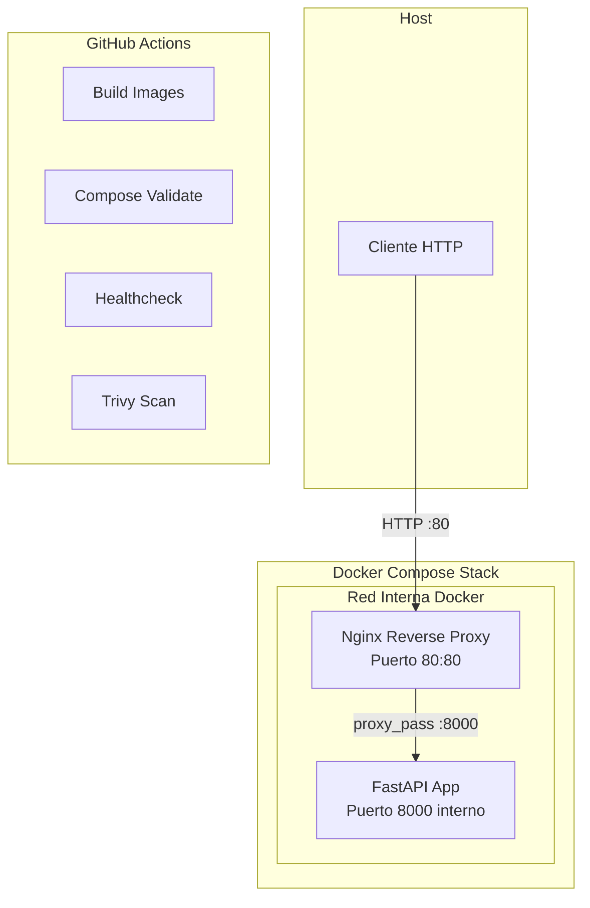
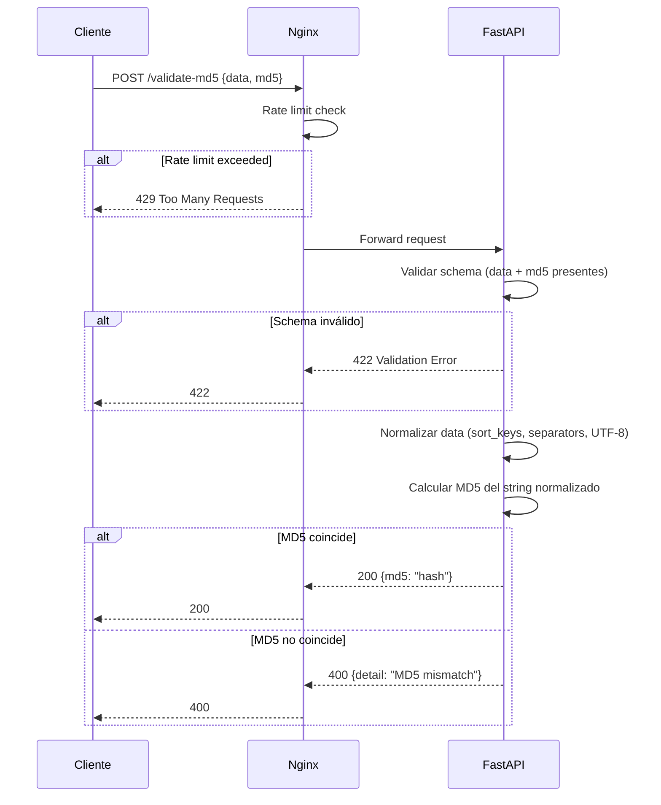

# Design Document: urbetrack-challenge

## Overview

Sistema DevOps/SRE challenge compuesto por una API REST (Python 3.12 + FastAPI) que valida checksums MD5 de payloads JSON, expuesta a través de Nginx como reverse proxy, orquestada con Docker Compose, automatizada con scripts Bash, y validada mediante un pipeline CI de GitHub Actions.

La arquitectura prioriza:
- **Aislamiento**: La API no es accesible directamente desde el host; solo Nginx (puerto 80) está expuesto.
- **Determinismo**: La normalización JSON garantiza hashes reproducibles independientemente del orden de claves.
- **Operabilidad**: Scripts estandarizados + CI pipeline cubren el ciclo build → deploy → validate → scan.

## Architecture

### Diagrama de Componentes



### Diagrama de Flujo - Validación MD5



### Decisiones Arquitectónicas

| Decisión | Alternativas Consideradas | Justificación |
|----------|--------------------------|---------------|
| FastAPI sobre Flask | Flask, Django | Auto-genera OpenAPI/Swagger, validación con Pydantic, async nativo, tipado |
| Nginx reverse proxy | Traefik, Caddy | Estándar de industria, configuración declarativa, rate limiting nativo |
| Multi-stage Dockerfile | Single-stage slim | Reduce tamaño final, separa build deps de runtime deps |
| Red interna Docker | Host networking | Aislamiento real: API inaccesible desde host sin pasar por Nginx |
| `sort_keys=True` + `separators=(',',':')` | Custom serializer | Estándar Python, determinista, sin dependencias externas |
| MD5 como algoritmo de hash | SHA-256, SHA-512 | Requerido por la consigna del challenge. MD5 es criptográficamente roto para colisiones pero válido como checksum de integridad. En producción se usaría SHA-256. |

## Components and Interfaces

### 1. FastAPI Application (`app/main.py`)

```python
from fastapi import FastAPI, HTTPException
from pydantic import BaseModel
from typing import Any
import hashlib
import json

app = FastAPI(title="Urbetrack MD5 Validator", version="1.0.0")

class ValidateMD5Request(BaseModel):
    data: Any  # Acepta cualquier JSON válido como valor
    md5: str   # Hash MD5 esperado (hex string, 32 chars)

class ValidateMD5Response(BaseModel):
    md5: str

class HealthResponse(BaseModel):
    status: str

class ErrorResponse(BaseModel):
    detail: str

def normalize_json(data: Any) -> str:
    """Normaliza un objeto Python a JSON canónico (sort_keys, compact separators, UTF-8)."""
    return json.dumps(data, sort_keys=True, separators=(',', ':'), ensure_ascii=False)

def compute_md5(normalized: str) -> str:
    """Calcula MD5 hex digest de un string UTF-8."""
    return hashlib.md5(normalized.encode('utf-8')).hexdigest()

@app.post("/validate-md5", response_model=ValidateMD5Response, responses={400: {"model": ErrorResponse}})
def validate_md5(payload: ValidateMD5Request) -> ValidateMD5Response:
    ...

@app.get("/health", response_model=HealthResponse)
def health() -> HealthResponse:
    ...
```

### 2. Nginx Configuration (`nginx/nginx.conf`)

```nginx
upstream api {
    server api:8000;
}

limit_req_zone $binary_remote_addr zone=validate:10m rate=10r/s;

server {
    listen 80;

    location /validate-md5 {
        limit_req zone=validate burst=20 nodelay;
        limit_req_status 429;
        proxy_pass http://api;
        proxy_set_header Host $host;
        proxy_set_header X-Real-IP $remote_addr;
        proxy_set_header X-Forwarded-For $proxy_add_x_forwarded_for;
    }

    location / {
        proxy_pass http://api;
        proxy_set_header Host $host;
        proxy_set_header X-Real-IP $remote_addr;
        proxy_set_header X-Forwarded-For $proxy_add_x_forwarded_for;
    }
}
```

### 3. Dockerfile

```dockerfile
# Stage 1: Dependencies
FROM python:3.12-slim AS builder
WORKDIR /app
COPY app/requirements.txt .
RUN pip install --no-cache-dir --prefix=/install -r requirements.txt

# Stage 2: Runtime
FROM python:3.12-slim AS runtime
RUN useradd --create-home --shell /bin/bash appuser
WORKDIR /app
COPY --from=builder /install /usr/local
COPY app/ .
USER appuser
EXPOSE 8000
HEALTHCHECK --interval=30s --timeout=5s --retries=3 \
    CMD python -c "import urllib.request; urllib.request.urlopen('http://localhost:8000/health')"
CMD ["uvicorn", "main:app", "--host", "0.0.0.0", "--port", "8000"]
```

### 4. Docker Compose (`docker-compose.yml`)

```yaml
services:
  api:
    build: .
    networks:
      - internal
    restart: unless-stopped

  nginx:
    image: nginx:1.25-alpine
    ports:
      - "80:80"
    volumes:
      - ./nginx/nginx.conf:/etc/nginx/conf.d/default.conf:ro
    depends_on:
      api:
        condition: service_healthy
    networks:
      - internal
    restart: unless-stopped

networks:
  internal:
    driver: bridge
    internal: false  # Nginx needs external access for port binding
```

### 5. Scripts Bash (`scripts/`)

| Script | Responsabilidad | Exit Code |
|--------|----------------|-----------|
| `build.sh` | `docker compose build` | Non-zero on failure |
| `start.sh` | `docker compose up -d` | Non-zero on failure |
| `stop.sh` | `docker compose down` | Non-zero on failure |
| `healthcheck.sh` | Loop `curl /health` cada 5s | Non-zero si falla |
| `dev.sh` | `docker compose up --build --watch` o bind mount + reload | Non-zero on failure |

### 6. GitHub Actions CI (`.github/workflows/ci.yml`)

```yaml
# Pasos principales:
# 1. Checkout
# 2. Set up Docker Buildx
# 3. Cache Docker layers (actions/cache)
# 4. Build images (tagged con commit SHA)
# 5. docker compose config (validación)
# 6. docker compose up -d
# 7. Wait + healthcheck real
# 8. Trivy scan (HIGH, CRITICAL) — bloquea pipeline con --exit-code 1
# 9. Secrets demo (env var injection)
# 10. Cleanup
```

## Data Models

### Request/Response Schemas

```python
# POST /validate-md5 - Request
{
    "data": Any,  # Cualquier valor JSON válido (object, array, string, number, bool, null)
    "md5": str    # Hex string de 32 caracteres
}

# POST /validate-md5 - Response 200
{
    "md5": str    # Hash MD5 validado
}

# POST /validate-md5 - Response 400
{
    "detail": str  # "MD5 mismatch: expected {expected}, got {computed}"
}

# POST /validate-md5 - Response 422 (Pydantic validation)
{
    "detail": [
        {
            "loc": ["body", "field_name"],
            "msg": str,
            "type": str
        }
    ]
}

# GET /health - Response 200
{
    "status": "healthy"
}
```

### Algoritmo de Normalización

```
Input: data (Any JSON-valid Python object)
Output: md5_hex (string, 32 hex chars)

1. normalized_str = json.dumps(data, sort_keys=True, separators=(',', ':'), ensure_ascii=False)
2. encoded_bytes = normalized_str.encode('utf-8')
3. md5_hex = hashlib.md5(encoded_bytes).hexdigest()
```

**Propiedades clave:**
- Determinista: mismo input lógico → mismo output siempre
- Recursivo: `sort_keys=True` ordena en todos los niveles de anidamiento
- Canónico: sin espacios, sin trailing newlines, separadores compactos

## Correctness Properties

### Property 1: Round-trip MD5 validation

*For any* valid JSON object used as `data`, computing the MD5 of its normalized form and sending both `data` and the computed `md5` to POST `/validate-md5` SHALL return HTTP 200 with the same MD5 hash in the response body.

**Validates: Requirements 1.1, 1.2**

### Property 2: Mismatch rejection

*For any* valid JSON object used as `data` and *for any* MD5 string that does NOT match the MD5 of the normalized `data`, sending both to POST `/validate-md5` SHALL return an HTTP error response indicating mismatch.

**Validates: Requirements 1.3**

### Property 3: Missing fields rejection

*For any* JSON payload that is missing the `data` field, the `md5` field, or both, POST `/validate-md5` SHALL return HTTP 422 with a validation error.

**Validates: Requirements 1.4**

### Property 4: Key-order independence of normalization

*For any* valid JSON object (including nested objects at arbitrary depth), normalizing the object SHALL produce identical output regardless of the original key ordering at any level of nesting.

**Validates: Requirements 10.1, 10.3**

### Property 5: Normalization idempotence

*For any* valid JSON object, normalizing the data and computing its MD5, then parsing the normalized string back to an object, re-normalizing, and computing MD5 again SHALL produce the identical hash.

**Validates: Requirements 10.2**

## Error Handling

### API Layer

| Escenario | HTTP Code | Response Body | Origen |
|-----------|-----------|---------------|--------|
| MD5 mismatch | 400 | `{"detail": "MD5 mismatch: expected {expected}, got {computed}"}` | Application logic |
| Missing fields (data/md5) | 422 | Pydantic validation error array | FastAPI/Pydantic |
| Invalid JSON body | 422 | Pydantic parsing error | FastAPI |
| Method not allowed | 405 | Default FastAPI | FastAPI |
| Rate limit exceeded | 429 | Nginx (con `limit_req_status 429`) | Nginx |

### Nginx Layer

- **Upstream timeout**: Si la API no responde en 60s, Nginx retorna 502 Bad Gateway.
- **Rate limiting**: Requests excediendo 10r/s con burst de 20 reciben 429 (configurado con `limit_req_status 429`).
- **Upstream down**: Si el contenedor API no está healthy, Nginx retorna 502.
- **Graceful shutdown**: Docker Compose envía SIGTERM a ambos contenedores. Uvicorn drena conexiones activas antes de terminar. Nginx cierra workers gracefully. `stop_grace_period` configurable en compose (default 10s antes de SIGKILL).

### Scripts Layer

- Todos los scripts usan `set -euo pipefail` para fallar inmediatamente ante errores.
- Exit codes no-cero propagados al caller (CI pipeline o usuario).
- `healthcheck.sh` reporta estado a stdout y sale con código 1 si el endpoint no responde.

### CI Pipeline

- GitHub Actions detiene la ejecución en el primer paso fallido (comportamiento por defecto).
- Trivy scan bloquea el pipeline con `--exit-code 1` si encuentra vulnerabilidades HIGH o CRITICAL.

## Supuestos

- Puerto 80 del host está libre (no hay otro servidor web corriendo).
- Docker y Docker Compose están instalados en el host.
- El runner de GitHub Actions tiene Docker disponible (ubuntu-latest lo incluye por defecto).

## Testing Strategy

### Enfoque Dual: Unit Tests + Property Tests

**Unit Tests** (pytest):
- Verifican ejemplos específicos y edge cases
- Testean integración entre componentes (API endpoint completo)
- Cubren condiciones de error específicas

**Property Tests** (pytest + Hypothesis):
- Verifican propiedades universales con inputs generados aleatoriamente
- Mínimo 100 iteraciones por propiedad
- Cubren: normalización determinista, round-trip validation, rejection correctness

### Librería PBT: Hypothesis

- Framework estándar de PBT para Python
- Generadores nativos para JSON (`from_type`, `dictionaries`, `recursive`)
- Integración nativa con pytest

### Estructura de Tests

```
tests/
├── test_normalize.py      # Property tests para normalización (Props 4, 5)
├── test_validate_md5.py   # Property tests para endpoint (Props 1, 2, 3)
├── test_health.py         # Unit tests para /health
└── conftest.py            # Fixtures (TestClient, generators)
```
